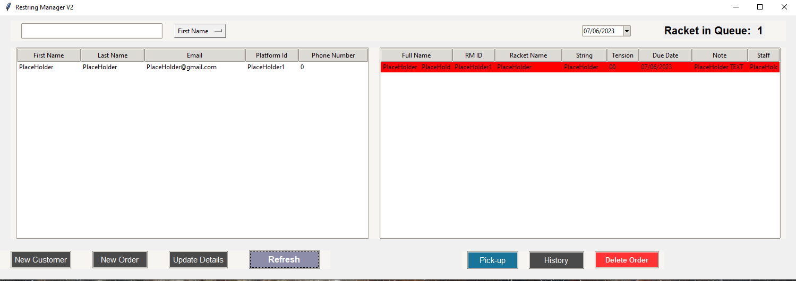

# Restring-Manager V2

## Purpose
Kept record of the customer as well as their order details for Auckland Badminton Pro-shop. Restring Manager works as an internal tool for shop staff to optimize operational workflow and increase retail efficiency.

## Features
- Create and record customers' entries.
- Create customers' order details.
- Print docket(order) from printer.
- Send receipt automatically when an order is done.
- View orders that are due on certain date.
- Search for a customer through selected category 
- Summarize sales (RMV3).
- Visualize staff workload (RMV3).

## User Manual 

> Main page of the Restring-Manager
